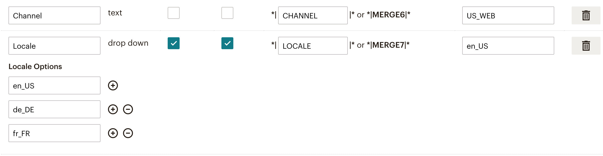

# Sylius Mailchimp Plugin

[![Latest Version on Packagist][ico-version]][link-packagist]
[![Software License][ico-license]](LICENSE)
[![Build Status][ico-travis]][link-travis]
[![Quality Score][ico-code-quality]][link-code-quality]

## Overview

This plugin has three main purposes:
1. Push your customers (as members/subscribers) to Mailchimp
2. Push your orders to Mailchimp utilizing their [ecommerce features](https://mailchimp.com/developer/guides/getting-started-with-ecommerce/)
3. Allow your customers to sign up for newsletters both in the checkout, but also using a form on your page

It does all this in a memory saving and performance optimized way.

## Installation

### 1. Install dependencies
This plugin uses the [Doctrine ORM Batcher bundle](https://github.com/Setono/DoctrineORMBatcherBundle). Install that first by following the instructions on that page.

### 2. Require plugin with composer:

```bash
$ composer require setono/sylius-mailchimp-plugin
```

### 3. Import configuration:

```yaml
# config/packages/setono_sylius_mailchimp.yaml
imports:
    - { resource: "@SetonoSyliusMailchimpPlugin/Resources/config/app/config.yaml" }
```

### 4. Import routing:
   
```yaml
# config/routes/setono_sylius_mailchimp.yaml
setono_sylius_mailchimp:
    resource: "@SetonoSyliusMailchimpPlugin/Resources/config/routing.yaml"
```

### 5. Add plugin class to your `bundles.php`:

```php
$bundles = [
    // ...
    
    Setono\SyliusMailchimpPlugin\SetonoSyliusMailchimpPlugin::class => ['all' => true],
    Sylius\Bundle\GridBundle\SyliusGridBundle::class => ['all' => true],
    
    // ...
];
```

Make sure you've added it **before** `SyliusGridBundle`. Otherwise you'll get exception like
`You have requested a non-existent parameter "setono_sylius_mailchimp.model.export.class"`.

### 6. Override core classes

- Override `Customer` entity:
     
    - If you use `annotations` mapping:
    
        ```php
        <?php
        
        # src/Entity/Customer.php 
  
        declare(strict_types=1);
        
        namespace App\Entity;
        
        use Sylius\Component\Core\Model\Customer as BaseCustomer;
        use Setono\SyliusMailchimpPlugin\Model\CustomerInterface as SetonoSyliusMailchimpPluginCustomerInterface;
        use Setono\SyliusMailchimpPlugin\Model\CustomerTrait as SetonoSyliusMailchimpPluginCustomerTrait;
        use Doctrine\ORM\Mapping as ORM;
            
        /**
         * @ORM\Entity
         * @ORM\Table(name="sylius_customer")
         */
        class Customer extends BaseCustomer implements SetonoSyliusMailchimpPluginCustomerInterface
        {
            use SetonoSyliusMailchimpPluginCustomerTrait;
        }
        ```
    
- Create `Doctrine/ORM/CustomerRepository.php`:

    ```php
    <?php
    
    declare(strict_types=1);
    
    namespace App\Doctrine\ORM;
    
    use Setono\SyliusMailchimpPlugin\Doctrine\ORM\CustomerRepositoryInterface as SetonoSyliusMailchimpPluginCustomerRepositoryInterface;
    use Setono\SyliusMailchimpPlugin\Doctrine\ORM\CustomerRepositoryTrait as SetonoSyliusMailchimpPluginCustomerRepositoryTrait;
    use Sylius\Bundle\CoreBundle\Doctrine\ORM\CustomerRepository as BaseCustomerRepository;
    
    class CustomerRepository extends BaseCustomerRepository implements SetonoSyliusMailchimpPluginCustomerRepositoryInterface
    {
        use SetonoSyliusMailchimpPluginCustomerRepositoryTrait;
    }
    ```

- Add configuration: 

    ```yaml
    # config/packages/_sylius.yaml
    sylius_customer:
        resources:
            customer:
                classes:
                    model: App\Entity\Customer
                    repository: App\Doctrine\ORM\CustomerRepository
    ```

### 7. Update your database:

```bash
$ php bin/console doctrine:migrations:diff
$ php bin/console doctrine:migrations:migrate
```

### 8. Make plugin configurations:

#### 1. Subscriptions form at shop's footer

- By default, subscription form will be added to footer via block events.

- If you want to disable subscription form, configure plugin like this: 

    ```yaml
    # config/packages/setono_sylius_mailchimp.yaml
    setono_sylius_mailchimp:
        subscribe: false
    ```
 
- If you want to add subscription form to custom place:

  - Configure plugin like this to disable automatic form inclusion to footer:
   
    ```yaml
    # config/packages/setono_sylius_mailchimp.yaml
    setono_sylius_mailchimp:
        subscribe: false
    ```

  - Include the subscribe form in your template to place you need:

    ```twig
    {# templates/bundles/SyliusShopBundle/_footer.html.twig #}

    
    ```
    
    See example at `tests/Application/templates/bundles/SyliusShopBundle/_footer.html.twig`.

#### 2. (optional) Create and/or configure Mailchimp Merge Fields

  - If you don't want to collect channel and locale of subscribers,
    (your shop works with just one channel and locale, for example)
    you can skip this step, as far as by default, plugin configured 
    to work with existing (Mailchimp's default) Merge Fields only:

    ```yaml
    # config/packages/setono_sylius_mailchimp.yaml
    setono_sylius_mailchimp:
        merge_fields:
            first_name: FNAME # Mailchimp's default
            last_name: LNAME  # Mailchimp's default
            address: ADDRESS  # Mailchimp's default
            phone: PHONE      # Mailchimp's default
            channel: false    # Which means don't store subscriber's channel at mailchimp side
            locale: false     # Which means don't store subscriber's locale at mailchimp side
    ```
    
  - If you want to use channel and locale Merge Fields:
  
    - Add desired Merge Fields at Mailchimp side like this:
      
      
      
      You can configure both channel and locale mergefield's type as `text` or as `dropdown`.
    
    - Configure plugin to use that Merge Fields names:
  
        ```yaml
        # config/packages/setono_sylius_mailchimp.yaml
        setono_sylius_mailchimp:
            merge_fields:
                channel: CHANNEL
                locale: LOCALE
        ```
        
      (You can use any other names for sure - `CHANNEL_CODE`, `LOCALE_CODE`, for example)

### 9. Install assets:

```bash
$ php bin/console assets:install --symlink
```

### 10. Clear cache:

```bash
$ php bin/console cache:clear
```

### 11. (production) Configure CRON jobs 

- To create exports - every day:

    ```bash
    * 03 * * * path/to/php path/to/bin/console setono:mailchimp:export:create -n
    ````

- To handle exports - every minute:

    ```bash
    01 * * * * path/to/php path/to/bin/console setono:mailchimp:export:handle --limit=30
    ````
    
    Providing such `limit` allow to export 30 customers per minute. 

## Usage

- You can now configure Mailchimp lists in your admin UI and later on 
  export them from via admin or the following command:

    ```bash
    $ php bin/console setono:mailchimp:export:create
    ````

- To handle created export, run: 

    ```bash
    $ php bin/console setono:mailchimp:export:handle
    ````

## Contribution

Run `composer try` to setup plugin environment and try test application.

Please, run `composer all` before pusing changes to run all checks and tests.

### Testing

Run `composer tests` to run all tests.

[ico-version]: https://img.shields.io/packagist/v/setono/sylius-mailchimp-plugin.svg?style=flat-square
[ico-license]: https://img.shields.io/badge/license-MIT-brightgreen.svg?style=flat-square
[ico-travis]: https://img.shields.io/travis/Setono/SyliusMailchimpPlugin/master.svg?style=flat-square
[ico-code-quality]: https://img.shields.io/scrutinizer/g/Setono/SyliusMailchimpPlugin.svg?style=flat-square

[link-packagist]: https://packagist.org/packages/setono/sylius-mailchimp-plugin
[link-travis]: https://travis-ci.org/Setono/SyliusMailchimpPlugin
[link-code-quality]: https://scrutinizer-ci.com/g/Setono/SyliusMailchimpPlugin
